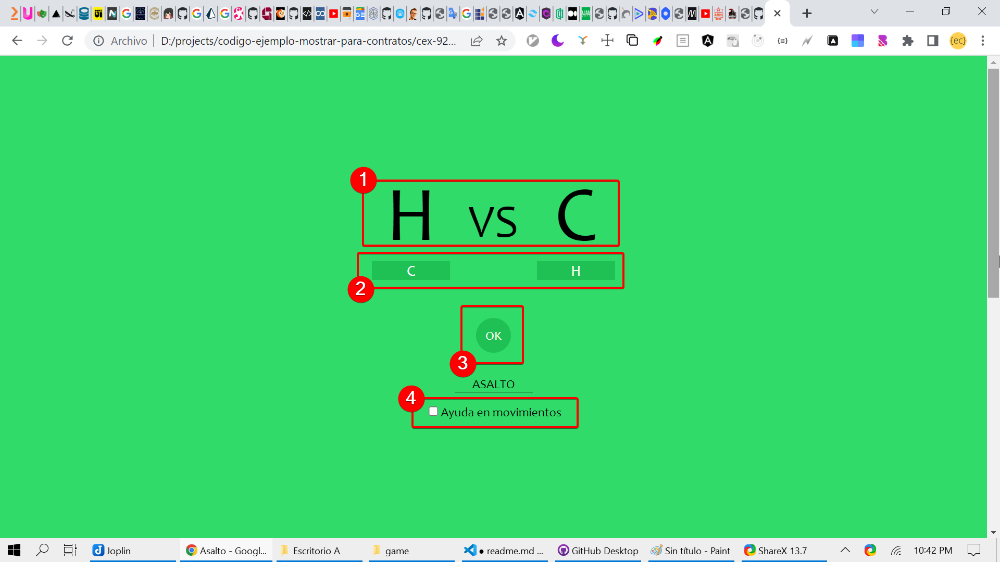
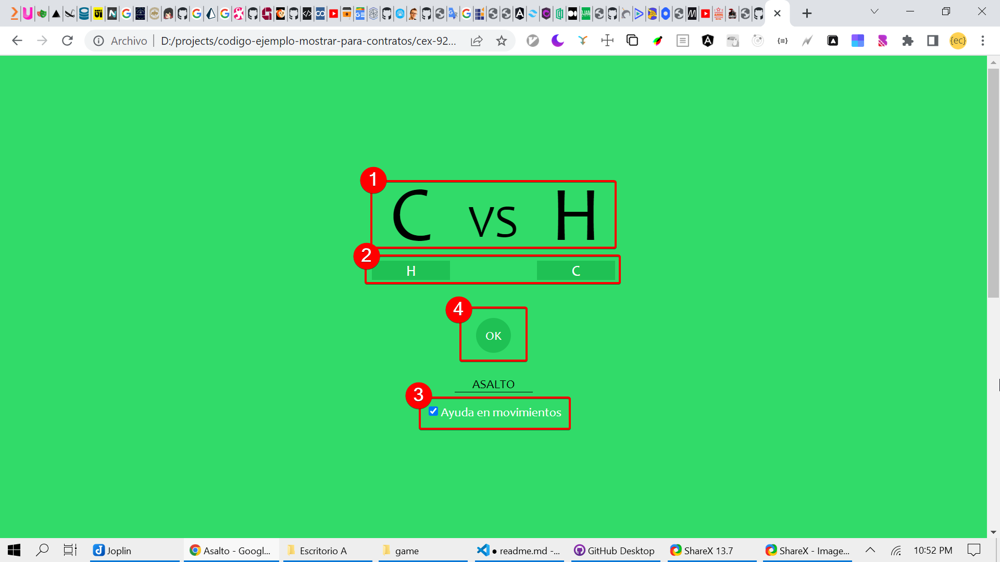
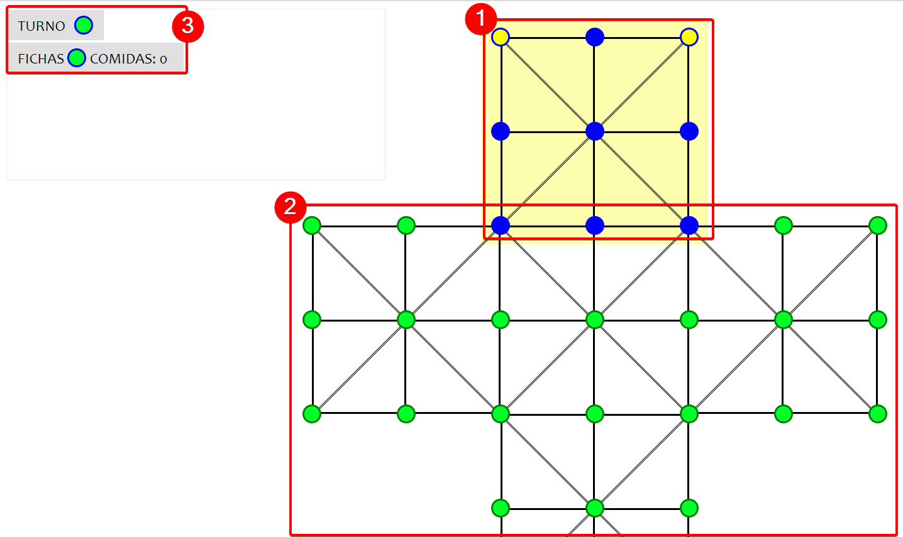
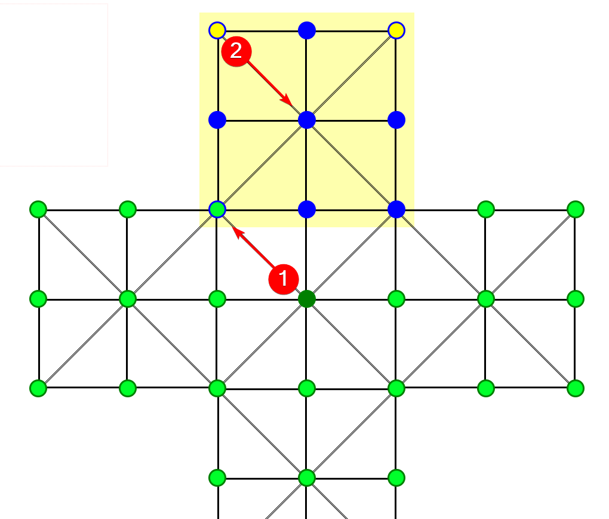
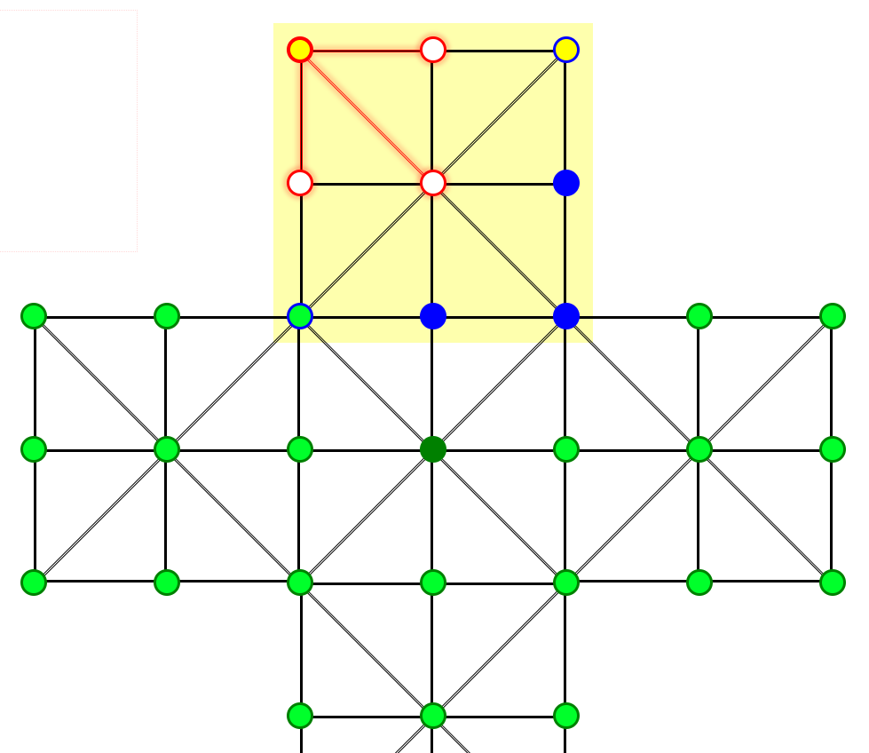
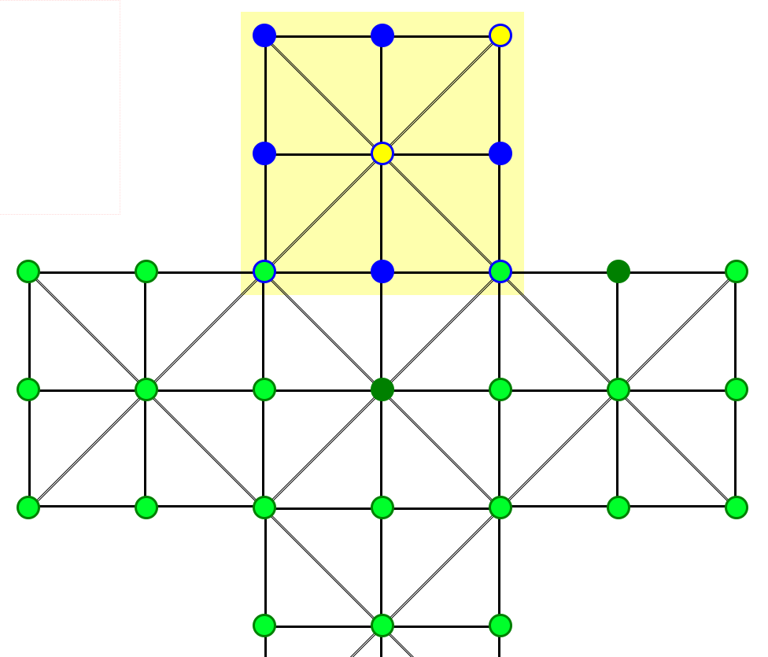
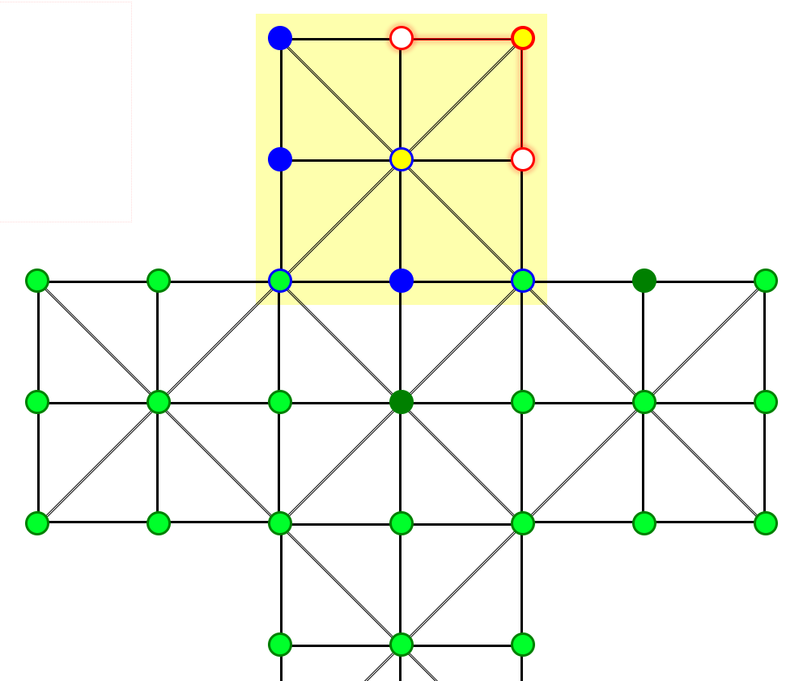
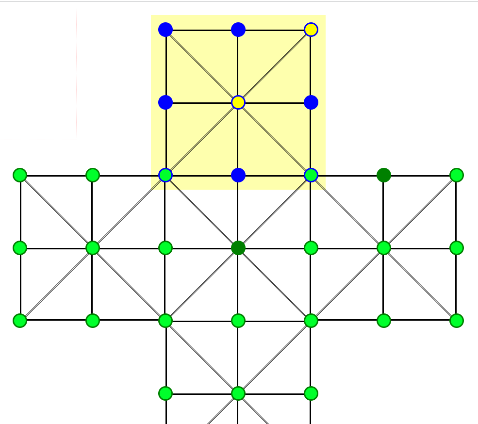
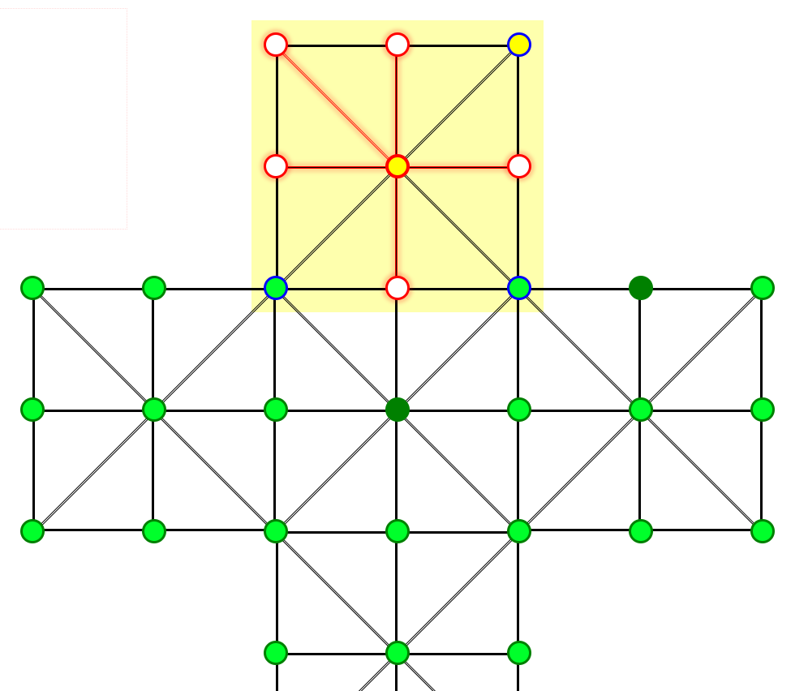
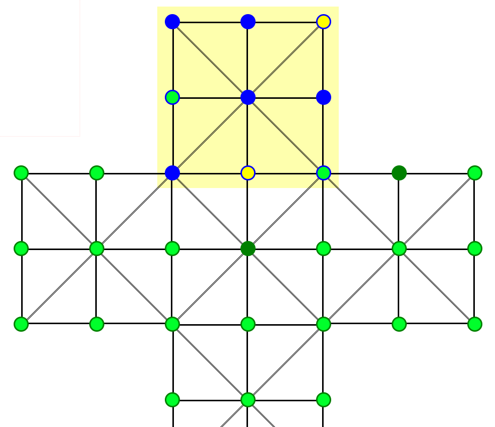

# Juego Asalto

> **IMPORTANTE:** el juego está inconcluso (humano vs pc), para poder jugar seguir los pasos a continuación (pc vs humano).

Asalto es un juego de mesa que permite jugar humano (H) vs PC (C) y el resto de combinaciones disponibles.

## Interfáz de inicio del juego

Como se muestra en la imágen anterior se describirán los puntos marcados.

1. Indica los tipos de oponentes (H - humano y C - PC) que se van a enfrentar.
2. Permite cambiar el tipo de oponente.
3. Inicia el juego.
4. Cuando está activa al seleccionar la ficha a mover se resaltán las ubicaciones a donde se puede mover la ficha.

Debido a que el juego está imcompleto, realizar la siguiente configuración que se muestra en la imágen, para poder jugar.

Activar el check **Ayuda en movimientos** es opcional.

## Como jugar

